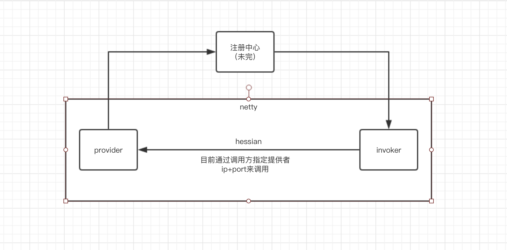

# Small-RPC

[](LICENSE)
[](https://www.oracle.com/java/)
[](https://netty.io/)
[](https://spring.io/)

## 描述

Small-RPC 是一款基于 Netty + Hessian 的精简版 RPC 框架，专为学习和理解 RPC 原理而设计。

⚠️ **注意**: 该框架仅适合学习使用，未经生产环境验证。

## 特性

- 🚀 **高性能**: 基于 Netty NIO 框架
- 🔄 **序列化**: 支持 Hessian 高效序列化
- 🔧 **Spring 集成**: 完美集成 Spring 生态
- 💡 **简单易用**: 注解驱动的开发方式
- 🛡️ **资源管理**: 优化的线程池和连接管理
- 📊 **监控友好**: 可观测的线程命名和错误处理

## 最新优化 (v1.0.0+)

### 🔧 依赖更新
- **Netty**: 4.1.39 → 4.1.108 (最新稳定版)
- **Spring**: 4.3.24 → 5.3.39 (安全更新)
- **Spring Boot**: 1.5.22 → 2.7.18 (LTS 版本)
- **Maven 插件**: 更新至最新版本

### ⚡ 性能优化
- **线程池增强**: 更好的命名和监控能力
- **资源管理**: 优雅关闭和超时控制
- **连接优化**: 更好的连接池管理和错误处理
- **Netty 配置**: 优化的 socket 选项设置

### 🛡️ 可靠性提升
- **错误处理**: 全面的异常处理和恢复机制
- **资源清理**: 自动资源清理和内存泄漏防护
- **参数验证**: 严格的输入参数验证
- **日志改进**: 更详细的调试信息

## 架构简图



## 工程结构

```
small-rpc
├── small-rpc-core                           -- 核心模块
├── small-rpc-simple                         -- Spring Boot 示例
│   ├── small-rpc-sample-springboot-api      -- 接口 API JAR
│   ├── small-rpc-sample-springboot-client   -- 调用方示例
│   └── small-rpc-sample-springboot-server   -- 服务提供方示例
```

## 快速开始

### 1. 构建项目

```bash
mvn clean package
```

### 2. 引入依赖

```xml
<dependency>
    <groupId>io.github.upowerman</groupId>
    <artifactId>small-rpc-core</artifactId>
    <version>1.0.0</version>
</dependency>
```

### 3. 服务提供方配置

```java
@Configuration
public class RpcProviderConfig {

    private Logger logger = LoggerFactory.getLogger(RpcProviderConfig.class);

    // Netty 端口
    @Value("${small-rpc.provider.port}")
    private int port;

    @Bean
    public RpcSpringProviderFactory rpcSpringProviderFactory() {
        // 核心类 获取服务提供类 启动 Netty
        RpcSpringProviderFactory providerFactory = new RpcSpringProviderFactory();
        providerFactory.setPort(port);
        providerFactory.setCorePoolSize(10);
        providerFactory.setMaxPoolSize(20);
        providerFactory.setServiceRegistryClass(LocalServiceRegistry.class);
        providerFactory.setServiceRegistryParam(Collections.EMPTY_MAP);
        return providerFactory;
    }
}
```

### 4. 服务消费方配置

```java
@Configuration
public class RpcInvokerConfig {
    private Logger logger = LoggerFactory.getLogger(RpcInvokerConfig.class);

    // 指定提供方地址
    @Value("${small-rpc.registry.address}")
    private String address;

    @Bean
    public RpcSpringInvokerFactory rpcInvokerFactory() {
        RpcSpringInvokerFactory invokerFactory = new RpcSpringInvokerFactory();
        invokerFactory.setServiceRegistryClass(LocalServiceRegistry.class);
        HashMap<String, String> params = new HashMap<>();
        // 指定提供方地址
        params.put(LocalServiceRegistry.DIRECT_ADDRESS, address);
        invokerFactory.setServiceRegistryParam(params);
        return invokerFactory;
    }
}
```

### 5. 服务实现

服务类需要使用 `@RpcService` 注解（服务必须在 IoC 容器中）：

```java
@Service
@RpcService
public class HelloServiceImpl implements HelloService {
    @Override
    public HelloDTO hello(String name) {
        return new HelloDTO("Hello " + name);
    }
}
```

### 6. 服务调用

消费方使用 `@RpcReference` 注解进行服务引用：

```java
@RestController
@RequestMapping("/")
public class HelloController {

    @RpcReference
    private HelloService helloService;

    @GetMapping("/hello")
    public HelloDTO hello(String name) {
        return helloService.hello(name);
    }
}
```

## 配置说明

### 线程池配置

```properties
# 核心线程数
small-rpc.provider.core-pool-size=10
# 最大线程数  
small-rpc.provider.max-pool-size=20
# 服务端口
small-rpc.provider.port=8080
```

### 网络配置

```properties
# 服务注册地址
small-rpc.registry.address=localhost:8080
# 连接超时时间
small-rpc.connect.timeout=10000
```

## 运行示例

1. 启动服务提供方：
```bash
cd small-rpc-simple/small-rpc-sample-springboot-server
mvn spring-boot:run
```

2. 启动服务消费方：
```bash
cd small-rpc-simple/small-rpc-sample-springboot-client  
mvn spring-boot:run
```

3. 访问测试接口：
```bash
curl http://localhost:8081/hello?name=World
```

## 版本历史

### v1.0.0+ (最新优化版)
- 🔧 依赖版本全面更新至稳定版本
- ⚡ 性能优化：线程池、连接管理、资源清理
- 🛡️ 增强错误处理和参数验证
- 📊 改进日志和监控能力
- 🔧 修复跨平台兼容性问题

### v1.0.0 (原始版本)
- 基础 RPC 功能实现
- Netty + Hessian 技术栈
- Spring 集成支持

## 参考资料

1. [Netty 官方文档](https://netty.io/wiki/)
2. [Spring Framework](https://spring.io/projects/spring-framework)
3. [Hessian 序列化](http://hessian.caucho.com/)
4. [参考项目 - Mango](https://github.com/TFdream/mango)
5. [参考项目 - Dubbo](https://github.com/apache/dubbo)

## 许可证

本项目基于 [Apache License 2.0](LICENSE) 开源协议。

## 贡献指南

欢迎提交 Issue 和 Pull Request 来改进项目！

1. Fork 项目
2. 创建特性分支
3. 提交变更
4. 推送到分支
5. 创建 Pull Request