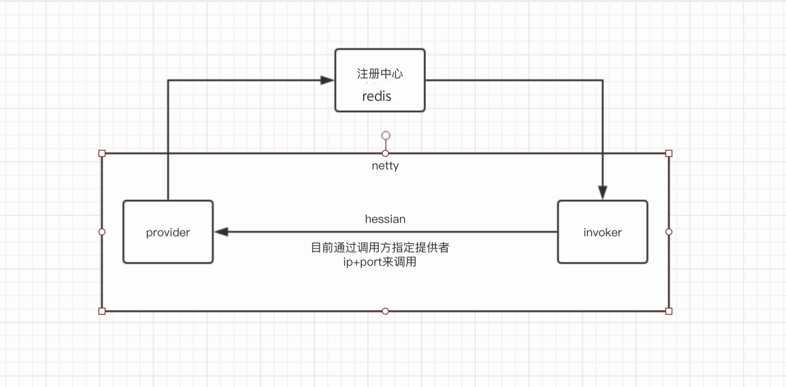
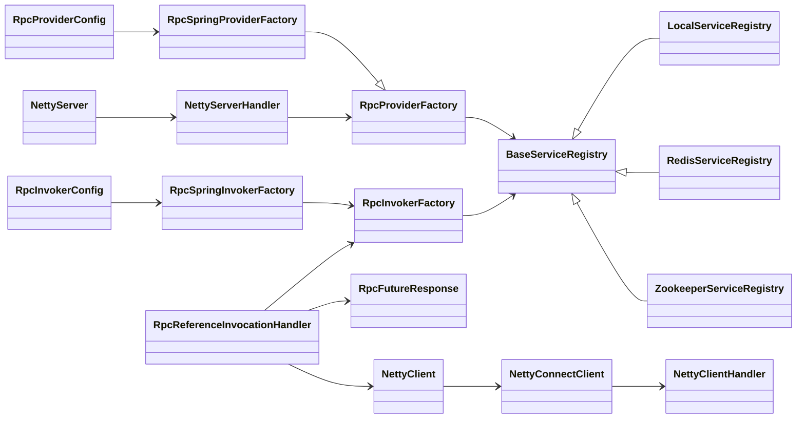
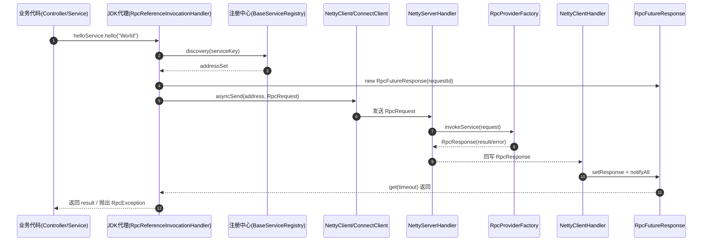

# Small-RPC

[](LICENSE)
[](https://www.oracle.com/java/)
[](https://netty.io/)
[](https://spring.io/)

## 描述

Small-RPC 是一款基于 Netty + Hessian 的精简版 RPC 框架，支持 Local / Redis / Zookeeper 注册中心，专为学习和理解 RPC 原理而设计。

⚠️ **注意**: 该框架仅适合学习使用，未经生产环境验证。

## 特性

- 🚀 **高性能**: 基于 Netty NIO 框架
- 🔄 **序列化**: 支持 Hessian 高效序列化
- 🔧 **Spring 集成**: 完美集成 Spring 生态
- 💡 **简单易用**: 注解驱动的开发方式
- 🛡️ **资源管理**: 优化的线程池和连接管理
- 📊 **监控友好**: 可观测的线程命名和错误处理

## 最新优化 (v1.2.0)

### 🔧 依赖更新
- **Netty**: 4.1.39 → 4.1.108 (最新稳定版)
- **Spring**: 4.3.24 → 5.3.39 (安全更新)
- **Spring Boot**: 1.5.22 → 2.7.18 (LTS 版本)
- **Maven 插件**: 更新至最新版本
- **注册中心扩展**: 支持 Local / Redis / Zookeeper，并通过配置项统一切换

### ⚡ 性能优化
- **线程池增强**: 更好的命名和监控能力
- **资源管理**: 优雅关闭和超时控制
- **连接优化**: 更好的连接池管理和错误处理
- **Netty 配置**: 优化的 socket 选项设置

### 🛡️ 可靠性提升
- **错误处理**: 全面的异常处理和恢复机制
- **资源清理**: 自动资源清理和内存泄漏防护
- **参数验证**: 严格的输入参数验证
- **日志改进**: 更详细的调试信息

## 架构简图



## 工程结构

```
small-rpc
├── small-rpc-core                           -- 核心模块
├── small-rpc-simple                         -- Spring Boot 示例
│   ├── small-rpc-sample-springboot-api      -- 接口 API JAR
│   ├── small-rpc-sample-springboot-client   -- 调用方示例
│   └── small-rpc-sample-springboot-server   -- 服务提供方示例
```

## 快速开始

### 1. 构建项目

```bash
mvn clean package
```

### 2. 引入依赖

```xml
<dependency>
    <groupId>io.github.upowerman</groupId>
    <artifactId>small-rpc-core</artifactId>
    <version>1.0.0</version>
</dependency>
```

### 3. 服务提供方配置

示例工程 `small-rpc-sample-springboot-server` 已内置统一配置类 `RpcProviderConfig`，通过配置项自动选择注册中心：

```properties
small-rpc.registry.type=local      # local | redis | zookeeper
small-rpc.provider.port=7080
```

### 4. 服务消费方配置

示例工程 `small-rpc-sample-springboot-client` 已内置统一配置类 `RpcInvokerConfig`，同样通过配置项自动选择注册中心：

```properties
small-rpc.registry.type=local      # local | redis | zookeeper
small-rpc.registry.address=localhost:7080   # 仅 local 模式需要
```

### 5. 服务实现

服务类需要使用 `@RpcService` 注解（服务必须在 IoC 容器中）：

```java
@Service
@RpcService
public class HelloServiceImpl implements HelloService {
    @Override
    public HelloDTO hello(String name) {
        return new HelloDTO("Hello " + name);
    }
}
```

### 6. 服务调用

消费方使用 `@RpcReference` 注解进行服务引用：

```java
@RestController
@RequestMapping("/")
public class HelloController {

    @RpcReference
    private HelloService helloService;

    @GetMapping("/hello")
    public HelloDTO hello(String name) {
        return helloService.hello(name);
    }
}
```

## RPC 全流程详解（入门必读）

这一节按“**服务启动** → **发起调用** → **服务执行** → **结果返回**”完整讲一次，建议结合 `small-rpc-core` 源码一起看。

### 1. 启动阶段：Provider 和 Consumer 各做了什么

#### 1.1 Provider 启动（服务端）

1. Spring 启动时加载 `RpcProviderConfig`，创建 `RpcSpringProviderFactory`。  
2. `RpcProviderConfig` 根据 `small-rpc.registry.type` 选择注册中心实现：  
   - `LocalServiceRegistry`
   - `RedisServiceRegistry`
   - `ZookeeperServiceRegistry`
3. `RpcSpringProviderFactory#setApplicationContext(...)` 扫描所有 `@RpcService` Bean。  
4. 每个 `@RpcService` 对应服务会调用 `RpcProviderFactory#addService(iface, version, bean)`，形成 `serviceKey -> serviceBean` 映射。  
   - `serviceKey` 由 `RpcProviderFactory.makeServiceKey(iface, version)` 生成（格式：`接口全名#版本`）。  
5. `RpcSpringProviderFactory#afterPropertiesSet()` 调用 `RpcProviderFactory#start()`：  
   - 初始化 `NettyServer`  
   - 设置 `onStart` 回调：服务端口绑定成功后，把已暴露服务注册到注册中心  
   - 设置 `onStop` 回调：停止时从注册中心移除节点并关闭注册中心

#### 1.2 Consumer 启动（调用端）

1. Spring 启动时加载 `RpcInvokerConfig`，创建 `RpcSpringInvokerFactory`。  
2. `RpcInvokerConfig` 同样根据 `small-rpc.registry.type` 选择注册中心实现并传参。  
3. `RpcSpringInvokerFactory#afterPropertiesSet()` 内部创建 `RpcInvokerFactory` 并启动注册中心客户端。  
4. `RpcSpringInvokerFactory#postProcessAfterInstantiation(...)` 扫描每个 Bean 的字段：  
   - 找到 `@RpcReference` 字段后，构建 `RpcReferenceBean`  
   - 调用 `RpcReferenceBean#getObject()` 生成 JDK 动态代理  
   - 把代理对象注入原字段（业务代码拿到的是代理，不是真实实现类）

---

### 2. 一次 RPC 调用从请求到返回的完整链路

假设业务代码执行：

```java
helloService.hello("World")
```

#### 2.1 Consumer 侧：组装请求 + 发包

1. 进入 `RpcReferenceInvocationHandler#invoke(...)`。  
2. 从 `RpcReferenceBean` 读取配置：`version`、`timeout`、`loadBalance`、`address`、`client`、`invokerFactory`。  
3. 若注解未写死 `address`，则走注册中心发现：  
   - 调用 `RpcProviderFactory.makeServiceKey(className, version)` 生成服务键  
   - 调用 `BaseServiceRegistry#discovery(serviceKey)` 获取地址集合  
   - 多地址时按 `LoadBalance`（ROUND/RANDOM）选择一个地址  
4. 创建 `RpcRequest`：  
   - `requestId`（UUID）  
   - `createMillisTime`  
   - `className / methodName / parameterTypes / parameters`  
   - `version`
5. 创建 `RpcFutureResponse` 并放入 `RpcInvokerFactory.futureResponsePool`（key=`requestId`）。  
6. 调用 `NettyClient#asyncSend(address, request)`。  
7. 底层 `ConnectClient.asyncSend(...)` 获取/创建 `NettyConnectClient` 连接并 `writeAndFlush` 发出请求。  
8. 当前线程在 `RpcFutureResponse#get(timeout)` 阻塞等待响应。

#### 2.2 Provider 侧：解码 + 执行 + 回包

1. `NettyServer` pipeline 通过 `NettyDecoder` 把字节流反序列化为 `RpcRequest`。  
2. `NettyServerHandler#channelRead0(...)` 收到请求后，丢到业务线程池执行。  
3. 在线程池中调用 `RpcProviderFactory#invokeService(request)`：  
   - 用 `className + version` 计算 `serviceKey`  
   - 从 `serviceData` 找到目标服务 Bean  
   - 通过反射 `method.invoke(serviceBean, parameters)` 执行真实业务方法  
   - 把结果写入 `RpcResponse.result`，异常写入 `RpcResponse.errorMsg`
4. `NettyServerHandler` 将 `RpcResponse` 回写到 Channel。

#### 2.3 Consumer 侧：收包 + 唤醒等待线程

1. `NettyClientHandler#channelRead0(...)` 收到 `RpcResponse`。  
2. 调用 `RpcInvokerFactory#notifyInvokerFuture(requestId, response)`。  
3. 找到对应 `RpcFutureResponse`，设置响应并 `notifyAll()`。  
4. 业务线程从 `future.get(timeout)` 返回：  
   - 若 `errorMsg != null`，抛 `RpcException`  
   - 否则返回 `result` 给业务代码

---

### 3. 关键类职责对照表（先记这些就够用）

| 类/组件 | 角色 | 关键职责 |
|---|---|---|
| `RpcProviderConfig` | Provider 配置入口 | 读取配置并装配 `RpcSpringProviderFactory`、注册中心类型和参数 |
| `RpcInvokerConfig` | Consumer 配置入口 | 读取配置并装配 `RpcSpringInvokerFactory`、注册中心类型和参数 |
| `RpcSpringProviderFactory` | Provider-Spring 桥接 | 扫描 `@RpcService`，收集服务并启动 `RpcProviderFactory` |
| `RpcSpringInvokerFactory` | Consumer-Spring 桥接 | 扫描 `@RpcReference`，创建并注入动态代理 |
| `RpcProviderFactory` | 服务端核心工厂 | 管理服务映射、注册/下线、反射调用 |
| `RpcInvokerFactory` | 调用端核心工厂 | 管理注册中心客户端、维护 requestId→future 映射 |
| `RpcReferenceInvocationHandler` | 动态代理调用入口 | 组装请求、服务发现、负载均衡、同步等待响应 |
| `RpcFutureResponse` | 同步等待容器 | 把异步网络响应转换成同步 `get(timeout)` 语义 |
| `NettyServer`/`NettyServerHandler` | 服务端网络层 | 接收请求、线程池执行、回写响应 |
| `NettyClient`/`NettyConnectClient`/`NettyClientHandler` | 调用端网络层 | 建连复用、发送请求、接收响应并回填 future |
| `BaseServiceRegistry` 及实现类 | 注册中心抽象层 | 提供 `registry/remove/discovery` 统一接口 |

---

### 4. 组件关系图（类协作）


```mermaid
classDiagram
direction LR

class RpcProviderConfig
class RpcInvokerConfig
class RpcSpringProviderFactory
class RpcProviderFactory
class RpcSpringInvokerFactory
class RpcInvokerFactory
class RpcReferenceInvocationHandler
class RpcFutureResponse
class NettyServer
class NettyServerHandler
class NettyClient
class NettyConnectClient
class NettyClientHandler
class BaseServiceRegistry
class LocalServiceRegistry
class RedisServiceRegistry
class ZookeeperServiceRegistry

RpcProviderConfig --> RpcSpringProviderFactory
RpcInvokerConfig --> RpcSpringInvokerFactory
RpcSpringProviderFactory --|> RpcProviderFactory
RpcSpringInvokerFactory --> RpcInvokerFactory
RpcReferenceInvocationHandler --> RpcInvokerFactory
RpcReferenceInvocationHandler --> NettyClient
RpcReferenceInvocationHandler --> RpcFutureResponse
NettyClient --> NettyConnectClient
NettyConnectClient --> NettyClientHandler
NettyServer --> NettyServerHandler
NettyServerHandler --> RpcProviderFactory
RpcProviderFactory --> BaseServiceRegistry
RpcInvokerFactory --> BaseServiceRegistry
BaseServiceRegistry <|-- LocalServiceRegistry
BaseServiceRegistry <|-- RedisServiceRegistry
BaseServiceRegistry <|-- ZookeeperServiceRegistry
```

### 5. 请求时序图（调用链）


```mermaid
sequenceDiagram
autonumber
participant B as 业务代码(Controller/Service)
participant P as JDK代理(RpcReferenceInvocationHandler)
participant R as 注册中心(BaseServiceRegistry)
participant C as NettyClient/ConnectClient
participant S as NettyServerHandler
participant F as RpcProviderFactory
participant H as NettyClientHandler
participant Future as RpcFutureResponse

B->>P: helloService.hello("World")
P->>R: discovery(serviceKey)
R-->>P: addressSet
P->>Future: new RpcFutureResponse(requestId)
P->>C: asyncSend(address, RpcRequest)
C->>S: 发送 RpcRequest
S->>F: invokeService(request)
F-->>S: RpcResponse(result/error)
S-->>H: 回写 RpcResponse
H->>Future: setResponse + notifyAll
Future-->>P: get(timeout) 返回
P-->>B: 返回 result / 抛出 RpcException
```

### 6. 三种注册中心在链路中的差异

三种模式的**调用主链路完全一致**，只在“服务地址来源”不同：

- `local`：`LocalServiceRegistry` 直接返回配置里的 `small-rpc.registry.address`。  
- `redis`：`RedisServiceRegistry` 从 Redis 集合读取健康实例并返回。  
- `zookeeper`：`ZookeeperServiceRegistry` 从 ZK 节点读取实例地址并返回。  

所以你可以把注册中心理解为“**地址簿插件**”，而不是调用流程本身。

## 配置说明

### 线程池配置

```properties
# 核心线程数
small-rpc.provider.core-pool-size=10
# 最大线程数  
small-rpc.provider.max-pool-size=20
# 服务端口
small-rpc.provider.port=8080
```

### 注册中心配置

```properties
# 注册中心类型: local | redis | zookeeper
small-rpc.registry.type=local
# local 模式下直连地址(consumer)
small-rpc.registry.address=localhost:8080
```

```properties
# redis 模式
small-rpc.registry.type=redis
small-rpc.redis.host=localhost
small-rpc.redis.port=6379
small-rpc.redis.password=
small-rpc.redis.database=0
small-rpc.redis.timeout=2000
```

```properties
# zookeeper 模式
small-rpc.registry.type=zookeeper
small-rpc.zookeeper.connect-string=localhost:2181
small-rpc.zookeeper.namespace=small-rpc
small-rpc.zookeeper.base-path=/services
small-rpc.zookeeper.session-timeout=60000
small-rpc.zookeeper.connection-timeout=15000
```

### Redis 模式运行

1. 启动 Redis：
```bash
docker run -d --name redis -p 6379:6379 redis:latest
```

2. 启动 provider：
```bash
cd small-rpc-simple/small-rpc-sample-springboot-server
mvn spring-boot:run -Dspring-boot.run.arguments="--small-rpc.registry.type=redis"
```

3. 启动 consumer：
```bash
cd small-rpc-simple/small-rpc-sample-springboot-client
mvn spring-boot:run -Dspring-boot.run.arguments="--small-rpc.registry.type=redis"
```

### Zookeeper 模式运行

1. 启动 Zookeeper：
```bash
docker run -d --name zookeeper -p 2181:2181 zookeeper:3.9
```

2. 启动 provider：
```bash
cd small-rpc-simple/small-rpc-sample-springboot-server
mvn spring-boot:run -Dspring-boot.run.arguments="--small-rpc.registry.type=zookeeper"
```

3. 启动 consumer：
```bash
cd small-rpc-simple/small-rpc-sample-springboot-client
mvn spring-boot:run -Dspring-boot.run.arguments="--small-rpc.registry.type=zookeeper"
```

## 运行示例

1. 启动服务提供方：
```bash
cd small-rpc-simple/small-rpc-sample-springboot-server
mvn spring-boot:run
```

2. 启动服务消费方：
```bash
cd small-rpc-simple/small-rpc-sample-springboot-client  
mvn spring-boot:run
```

使用 Redis 或 Zookeeper 时，在配置文件中把 `small-rpc.registry.type` 改成 `redis` 或 `zookeeper`，或通过启动参数覆盖。

3. 访问测试接口：
```bash
curl http://localhost:8081/hello?name=World
```

## 版本历史

### v1.2.0 (最新版本)
- ✅ 新增 Zookeeper 注册中心实现
- ✅ 注册中心统一改为配置驱动选择：`local | redis | zookeeper`
- ✅ 示例工程配置简化为单入口（provider/client 统一配置方式）
- ✅ 文档更新，补充多注册中心使用方式

### v1.1.0
- 🔧 依赖版本更新至稳定版本（Netty / Spring / Spring Boot）
- ⚡ 线程池、连接管理、资源清理等性能优化
- 🛡️ 参数校验与异常处理增强
- 📊 日志与可观测性改进

### v1.0.0
- 基础 RPC 功能实现
- Netty + Hessian 技术栈
- Spring 集成支持

## 参考资料

1. [Netty 官方文档](https://netty.io/wiki/)
2. [Spring Framework](https://spring.io/projects/spring-framework)
3. [Hessian 序列化](http://hessian.caucho.com/)
4. [参考项目 - Mango](https://github.com/TFdream/mango)
5. [参考项目 - Dubbo](https://github.com/apache/dubbo)

## 许可证

本项目基于 [Apache License 2.0](LICENSE) 开源协议。

## 贡献指南

欢迎提交 Issue 和 Pull Request 来改进项目！

1. Fork 项目
2. 创建特性分支
3. 提交变更
4. 推送到分支
5. 创建 Pull Request