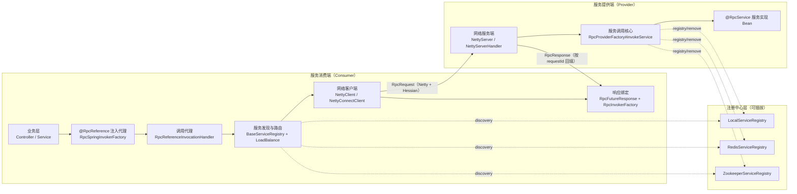
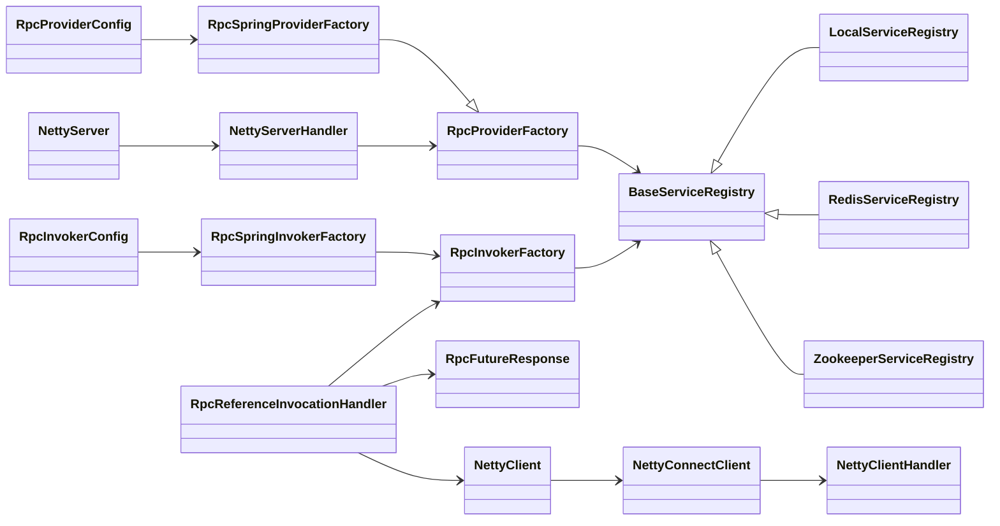
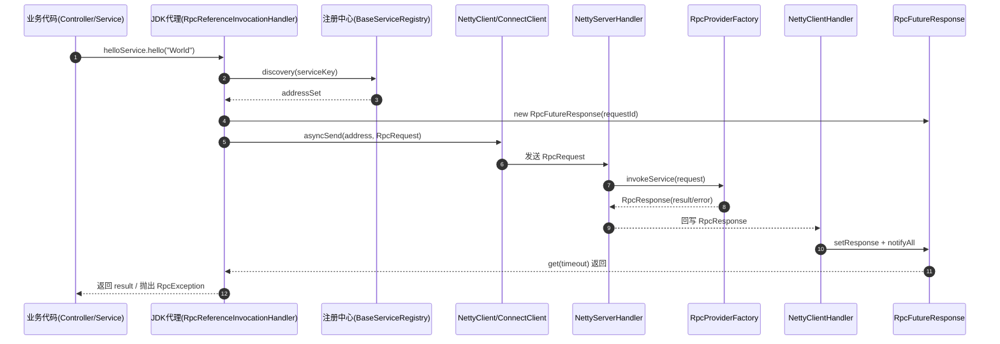

# Small-RPC

[](LICENSE)
[](https://www.oracle.com/java/)
[](https://netty.io/)
[](https://spring.io/)

## 描述

Small-RPC 是一款基于 Netty + Hessian 的精简版 RPC 框架，2.0 起拆分为多模块并内置自研 SPI（注册中心 / 序列化器 / 负载均衡可插拔），专为学习和理解 RPC 原理而设计。当前支持 Local 直连注册中心（Zookeeper / Redis 属 P3 规划）。

⚠️ **注意**: 该框架仅适合学习使用，未经生产环境验证。

## 特性

- 🚀 **多模块**: rpc-core（零协议 / 零传输依赖）+ rpc-transport-netty + rpc-registry-local + small-rpc-spring + small-rpc-spring-boot-starter
- 🔄 **自研 SPI**: `@Spi` 默认扩展、`@SpiInject` 注入（带环检测）、`@Adaptive` 自适应分发，异常一律大声失败
- 🌐 **可插拔**: 注册中心 / 序列化器 / 负载均衡均经 SPI 装配，登记文件 `META-INF/small-rpc/<接口FQCN>`
- 🛡️ **调用链路**: Filter 链 + Failover 集群容错（按状态码重试）+ deadline 预算超时
- 🔧 **Spring Boot Starter**: `@RpcService` / `@RpcReference` 注解驱动，`small-rpc.*` 配置驱动装配
- 📊 **监控友好**: 可观测的线程命名和错误处理

## 工程结构

```
small-rpc
├── rpc-core                        -- 核心抽象：invocation / invoker / cluster / directory / filter / loadbalance / SPI
├── rpc-transport-netty             -- 自研协议 + Netty 传输 + Hessian 序列化 + RpcServer
├── rpc-registry-local              -- Local 直连注册中心（SPI 实现）
├── small-rpc-spring                -- @RpcService / @RpcReference + ReferenceBeanPostProcessor
├── small-rpc-spring-boot-starter   -- Spring Boot 自动装配 + small-rpc.* 配置
└── rpc-examples                    -- 示例：rpc-example-api / rpc-example-client / rpc-example-server
```

## 快速开始

### 1. 构建项目

```bash
mvn clean package
```

### 2. 引入依赖

服务端与消费方都从 starter 进入（按需再引注册中心实现）：

```xml
<dependency>
    <groupId>io.github.upowerman</groupId>
    <artifactId>small-rpc-spring-boot-starter</artifactId>
    <version>1.0.0</version>
</dependency>
<dependency>
    <groupId>io.github.upowerman</groupId>
    <artifactId>rpc-registry-local</artifactId>
    <version>1.0.0</version>
</dependency>
```

### 3. 配置

provider 应用（显式关掉 consumer 侧装配）：

```yaml
small-rpc:
  provider:
    rpc2-port: 7081
  consumer:
    enabled: false
```

consumer 应用（显式关掉 provider 侧装配，指向 provider 地址）：

```yaml
small-rpc:
  provider:
    enabled: false
  registry:
    type: local
    param:
      DIRECT_ADDRESS: localhost:7081
  loadbalance: random      # 负载均衡扩展名（SPI 名），空 = SPI 默认
```

### 4. 服务实现

服务类需要使用 `@RpcService` 注解（服务必须在 IoC 容器中，且只实现一个业务接口）：

```java
@Service
@RpcService
public class HelloServiceImpl implements HelloService {
    @Override
    public HelloDTO hello(String name) {
        return new HelloDTO("Hello " + name);
    }
}
```

### 5. 服务调用

消费方使用 `@RpcReference` 注解进行服务引用（`address` 可指定直连地址 `host:port`，空 = 走注册中心）：

```java
@RestController
@RequestMapping("/")
public class HelloController {

    @RpcReference
    private HelloService helloService;

    @GetMapping("/hello")
    public HelloDTO hello(String name) {
        return helloService.hello(name);
    }
}
```

## SPI 扩展机制

登记文件放 classpath 下 `META-INF/small-rpc/<接口全限定名>`，行格式 `扩展名=实现类全限定名`，`#` 开头为注释：

```
# META-INF/small-rpc/io.github.upowerman.core.loadbalance.LoadBalancer
random=io.github.upowerman.core.loadbalance.RandomLoadBalancer
roundrobin=io.github.upowerman.core.loadbalance.RoundRobinLoadBalancer
```

内置扩展点与当前实现：

| 接口 | SPI 名 | 默认 |
|---|---|---|
| `BaseServiceRegistry`（注册中心） | local | 是（`@Spi("local")`） |
| `Serializer`（序列化） | hessian（typeId=1） | 是 |
| `LoadBalancer`（负载均衡） | random / roundrobin | random（`@Spi("random")`） |

三个特性：

- `@Spi("name")` 标注在**接口**上声明默认扩展名；
- `@SpiInject` 字段注入该 SPI 的默认扩展（同线程环依赖大声失败）；
- `@Adaptive("key")` 生成自适应代理：按 `attachments[key]` 选扩展再委托，键缺失走默认扩展。

重名登记按 `(name, FQCN)` 去重：同一实现经多个 URL 可见（如 `target/classes` 与本地已安装 jar 同在 classpath）视为重复并忽略；同名不同实现则启动即抛 ISE。

## 配置说明

### 2.0 配置项

| 配置项 | 默认 | 说明 |
|---|---|---|
| `small-rpc.provider.enabled` | true | 是否装配 provider（纯消费方应用请显式关掉） |
| `small-rpc.provider.rpc2-port` | 7081 | RpcServer 监听端口 |
| `small-rpc.consumer.enabled` | true | 是否装配 consumer |
| `small-rpc.registry.type` | local | 注册中心扩展名（SPI 名） |
| `small-rpc.registry.param.*` | — | 注册中心启动参数；local 模式放 `DIRECT_ADDRESS` |
| `small-rpc.loadbalance` | SPI 默认 | 负载均衡扩展名，`@RpcReference.loadBalance` 未指定时生效 |

Zookeeper / Redis 注册中心属 P3 规划，2.0 仅提供 Local 直连（`rpc-registry-local`）。

## 运行示例

1. 启动服务提供方：
```bash
cd rpc-examples/rpc-example-server
mvn spring-boot:run
```

2. 启动服务消费方：
```bash
cd rpc-examples/rpc-example-client
mvn spring-boot:run
```

3. 访问测试接口：
```bash
curl "http://localhost:8091/hello?name=World"
```

## 附录：1.x 架构与全流程详解（历史文档）

> 以下两章写于 1.x，其中的类名 / 端口 / 配置键（`small-rpc-core`、`small-rpc-simple`、
> `RpcInvokerFactory`、`RpcSpringProviderFactory`、7080 等）在 2.0 已变更，仅作 RPC 原理参考。
> 2.0 的调用链路：业务代理 → TraceFilter → FailoverClusterInvoker
> （directory：注册中心发现，或 `@RpcReference.address` 直连）→ LoadBalancer（SPI）
> → RemoteInvoker → NettyTransport → RpcServer → ReflectiveInvoker → 回帧。

### 架构简图


```mermaid
flowchart LR
    subgraph Consumer["服务消费端（Consumer）"]
        C1["业务层<br/>Controller / Service"]
        C2["@RpcReference 注入代理<br/>RpcSpringInvokerFactory"]
        C3["调用代理<br/>RpcReferenceInvocationHandler"]
        C4["服务发现与路由<br/>BaseServiceRegistry + LoadBalance"]
        C5["网络客户端<br/>NettyClient / NettyConnectClient"]
        C6["响应绑定<br/>RpcFutureResponse + RpcInvokerFactory"]
        C1 --> C2 --> C3 --> C4 --> C5
        C5 --> C6
    end

    subgraph Registry["注册中心层（可插拔）"]
        R1["LocalServiceRegistry"]
        R2["RedisServiceRegistry"]
        R3["ZookeeperServiceRegistry"]
    end

    subgraph Provider["服务提供端（Provider）"]
        P1["网络服务端<br/>NettyServer / NettyServerHandler"]
        P2["服务调用核心<br/>RpcProviderFactory#invokeService"]
        P3["@RpcService 服务实现 Bean"]
        P1 --> P2 --> P3
    end

    C4 -. discovery .-> R1
    C4 -. discovery .-> R2
    C4 -. discovery .-> R3
    P2 -. registry/remove .-> R1
    P2 -. registry/remove .-> R2
    P2 -. registry/remove .-> R3

    C5 -- "RpcRequest（Netty + Hessian）" --> P1
    P1 -- "RpcResponse（按 requestId 回填）" --> C6
```

> 说明：主调用链固定为 **Consumer 代理调用 → 注册中心发现地址 → Netty 发送请求 → Provider 反射执行 → 响应回填 future**，`local/redis/zookeeper` 仅影响“地址发现与注册”环节。

### RPC 全流程详解（入门必读）

这一节按“**服务启动** → **发起调用** → **服务执行** → **结果返回**”完整讲一次，建议结合 `small-rpc-core` 源码一起看。

### 1. 启动阶段：Provider 和 Consumer 各做了什么

#### 1.1 Provider 启动（服务端）

1. Spring 启动时加载 `RpcProviderConfig`，创建 `RpcSpringProviderFactory`。  
2. `RpcProviderConfig` 根据 `small-rpc.registry.type` 选择注册中心实现：  
   - `LocalServiceRegistry`
   - `RedisServiceRegistry`
   - `ZookeeperServiceRegistry`
3. `RpcSpringProviderFactory#setApplicationContext(...)` 扫描所有 `@RpcService` Bean。  
4. 每个 `@RpcService` 对应服务会调用 `RpcProviderFactory#addService(iface, version, bean)`，形成 `serviceKey -> serviceBean` 映射。  
   - `serviceKey` 由 `RpcProviderFactory.makeServiceKey(iface, version)` 生成（格式：`接口全名#版本`）。  
5. `RpcSpringProviderFactory#afterPropertiesSet()` 调用 `RpcProviderFactory#start()`：  
   - 初始化 `NettyServer`  
   - 设置 `onStart` 回调：服务端口绑定成功后，把已暴露服务注册到注册中心  
   - 设置 `onStop` 回调：停止时从注册中心移除节点并关闭注册中心

#### 1.2 Consumer 启动（调用端）

1. Spring 启动时加载 `RpcInvokerConfig`，创建 `RpcSpringInvokerFactory`。  
2. `RpcInvokerConfig` 同样根据 `small-rpc.registry.type` 选择注册中心实现并传参。  
3. `RpcSpringInvokerFactory#afterPropertiesSet()` 内部创建 `RpcInvokerFactory` 并启动注册中心客户端。  
4. `RpcSpringInvokerFactory#postProcessAfterInstantiation(...)` 扫描每个 Bean 的字段：  
   - 找到 `@RpcReference` 字段后，构建 `RpcReferenceBean`  
   - 调用 `RpcReferenceBean#getObject()` 生成 JDK 动态代理  
   - 把代理对象注入原字段（业务代码拿到的是代理，不是真实实现类）

---

### 2. 一次 RPC 调用从请求到返回的完整链路

假设业务代码执行：

```java
helloService.hello("World")
```

#### 2.1 Consumer 侧：组装请求 + 发包

1. 进入 `RpcReferenceInvocationHandler#invoke(...)`。  
2. 从 `RpcReferenceBean` 读取配置：`version`、`timeout`、`loadBalance`、`address`、`client`、`invokerFactory`。  
3. 若注解未写死 `address`，则走注册中心发现：  
   - 调用 `RpcProviderFactory.makeServiceKey(className, version)` 生成服务键  
   - 调用 `BaseServiceRegistry#discovery(serviceKey)` 获取地址集合  
   - 多地址时按 `LoadBalance`（ROUND/RANDOM）选择一个地址  
4. 创建 `RpcRequest`：  
   - `requestId`（UUID）  
   - `createMillisTime`  
   - `className / methodName / parameterTypes / parameters`  
   - `version`
5. 创建 `RpcFutureResponse` 并放入 `RpcInvokerFactory.futureResponsePool`（key=`requestId`）。  
6. 调用 `NettyClient#asyncSend(address, request)`。  
7. 底层 `ConnectClient.asyncSend(...)` 获取/创建 `NettyConnectClient` 连接并 `writeAndFlush` 发出请求。  
8. 当前线程在 `RpcFutureResponse#get(timeout)` 阻塞等待响应。

#### 2.2 Provider 侧：解码 + 执行 + 回包

1. `NettyServer` pipeline 通过 `NettyDecoder` 把字节流反序列化为 `RpcRequest`。  
2. `NettyServerHandler#channelRead0(...)` 收到请求后，丢到业务线程池执行。  
3. 在线程池中调用 `RpcProviderFactory#invokeService(request)`：  
   - 用 `className + version` 计算 `serviceKey`  
   - 从 `serviceData` 找到目标服务 Bean  
   - 通过反射 `method.invoke(serviceBean, parameters)` 执行真实业务方法  
   - 把结果写入 `RpcResponse.result`，异常写入 `RpcResponse.errorMsg`
4. `NettyServerHandler` 将 `RpcResponse` 回写到 Channel。

#### 2.3 Consumer 侧：收包 + 唤醒等待线程

1. `NettyClientHandler#channelRead0(...)` 收到 `RpcResponse`。  
2. 调用 `RpcInvokerFactory#notifyInvokerFuture(requestId, response)`。  
3. 找到对应 `RpcFutureResponse`，设置响应并 `notifyAll()`。  
4. 业务线程从 `future.get(timeout)` 返回：  
   - 若 `errorMsg != null`，抛 `RpcException`  
   - 否则返回 `result` 给业务代码

---

### 3. 关键类职责对照表（先记这些就够用）

| 类/组件 | 角色 | 关键职责 |
|---|---|---|
| `RpcProviderConfig` | Provider 配置入口 | 读取配置并装配 `RpcSpringProviderFactory`、注册中心类型和参数 |
| `RpcInvokerConfig` | Consumer 配置入口 | 读取配置并装配 `RpcSpringInvokerFactory`、注册中心类型和参数 |
| `RpcSpringProviderFactory` | Provider-Spring 桥接 | 扫描 `@RpcService`，收集服务并启动 `RpcProviderFactory` |
| `RpcSpringInvokerFactory` | Consumer-Spring 桥接 | 扫描 `@RpcReference`，创建并注入动态代理 |
| `RpcProviderFactory` | 服务端核心工厂 | 管理服务映射、注册/下线、反射调用 |
| `RpcInvokerFactory` | 调用端核心工厂 | 管理注册中心客户端、维护 requestId→future 映射 |
| `RpcReferenceInvocationHandler` | 动态代理调用入口 | 组装请求、服务发现、负载均衡、同步等待响应 |
| `RpcFutureResponse` | 同步等待容器 | 把异步网络响应转换成同步 `get(timeout)` 语义 |
| `NettyServer`/`NettyServerHandler` | 服务端网络层 | 接收请求、线程池执行、回写响应 |
| `NettyClient`/`NettyConnectClient`/`NettyClientHandler` | 调用端网络层 | 建连复用、发送请求、接收响应并回填 future |
| `BaseServiceRegistry` 及实现类 | 注册中心抽象层 | 提供 `registry/remove/discovery` 统一接口 |

---

### 4. 组件关系图（类协作）


```mermaid
classDiagram
direction LR

class RpcProviderConfig
class RpcInvokerConfig
class RpcSpringProviderFactory
class RpcProviderFactory
class RpcSpringInvokerFactory
class RpcInvokerFactory
class RpcReferenceInvocationHandler
class RpcFutureResponse
class NettyServer
class NettyServerHandler
class NettyClient
class NettyConnectClient
class NettyClientHandler
class BaseServiceRegistry
class LocalServiceRegistry
class RedisServiceRegistry
class ZookeeperServiceRegistry

RpcProviderConfig --> RpcSpringProviderFactory
RpcInvokerConfig --> RpcSpringInvokerFactory
RpcSpringProviderFactory --|> RpcProviderFactory
RpcSpringInvokerFactory --> RpcInvokerFactory
RpcReferenceInvocationHandler --> RpcInvokerFactory
RpcReferenceInvocationHandler --> NettyClient
RpcReferenceInvocationHandler --> RpcFutureResponse
NettyClient --> NettyConnectClient
NettyConnectClient --> NettyClientHandler
NettyServer --> NettyServerHandler
NettyServerHandler --> RpcProviderFactory
RpcProviderFactory --> BaseServiceRegistry
RpcInvokerFactory --> BaseServiceRegistry
BaseServiceRegistry <|-- LocalServiceRegistry
BaseServiceRegistry <|-- RedisServiceRegistry
BaseServiceRegistry <|-- ZookeeperServiceRegistry
```

### 5. 请求时序图（调用链）


```mermaid
sequenceDiagram
autonumber
participant B as 业务代码(Controller/Service)
participant P as JDK代理(RpcReferenceInvocationHandler)
participant R as 注册中心(BaseServiceRegistry)
participant C as NettyClient/ConnectClient
participant S as NettyServerHandler
participant F as RpcProviderFactory
participant H as NettyClientHandler
participant Future as RpcFutureResponse

B->>P: helloService.hello("World")
P->>R: discovery(serviceKey)
R-->>P: addressSet
P->>Future: new RpcFutureResponse(requestId)
P->>C: asyncSend(address, RpcRequest)
C->>S: 发送 RpcRequest
S->>F: invokeService(request)
F-->>S: RpcResponse(result/error)
S-->>H: 回写 RpcResponse
H->>Future: setResponse + notifyAll
Future-->>P: get(timeout) 返回
P-->>B: 返回 result / 抛出 RpcException
```

### 6. 三种注册中心在链路中的差异

三种模式的**调用主链路完全一致**，只在“服务地址来源”不同：

- `local`：`LocalServiceRegistry` 直接返回配置里的 `small-rpc.registry.address`。  
- `redis`：`RedisServiceRegistry` 从 Redis 集合读取健康实例并返回。  
- `zookeeper`：`ZookeeperServiceRegistry` 从 ZK 节点读取实例地址并返回。  

所以你可以把注册中心理解为“**地址簿插件**”，而不是调用流程本身。

## 版本历史

### 2.0.0 (P2，当前版本)
- ✅ 多模块拆分：rpc-core 只依赖 slf4j-api；协议 / Netty / Hessian 迁入 rpc-transport-netty
- ✅ 自研 SPI 三特性：`@Spi` 默认扩展、`@SpiInject` 注入（环检测）、`@Adaptive` 自适应分发
- ✅ Spring Boot starter 自动装配：`small-rpc.*` 配置驱动，样例纯 2.0
- ✅ `@RpcReference.address` 直连（1.x 能力回归），`small-rpc.loadbalance` 配置生效

### v1.2.0
- ✅ 新增 Zookeeper 注册中心实现
- ✅ 注册中心统一改为配置驱动选择：`local | redis | zookeeper`
- ✅ 示例工程配置简化为单入口（provider/client 统一配置方式）
- ✅ 文档更新，补充多注册中心使用方式

### v1.1.0
- 🔧 依赖版本更新至稳定版本（Netty / Spring / Spring Boot）
- ⚡ 线程池、连接管理、资源清理等性能优化
- 🛡️ 参数校验与异常处理增强
- 📊 日志与可观测性改进

### v1.0.0
- 基础 RPC 功能实现
- Netty + Hessian 技术栈
- Spring 集成支持

## 参考资料

1. [Netty 官方文档](https://netty.io/wiki/)
2. [Spring Framework](https://spring.io/projects/spring-framework)
3. [Hessian 序列化](http://hessian.caucho.com/)
4. [参考项目 - Mango](https://github.com/TFdream/mango)
5. [参考项目 - Dubbo](https://github.com/apache/dubbo)

## 许可证

本项目基于 [Apache License 2.0](LICENSE) 开源协议。

## 贡献指南

欢迎提交 Issue 和 Pull Request 来改进项目！

1. Fork 项目
2. 创建特性分支
3. 提交变更
4. 推送到分支
5. 创建 Pull Request