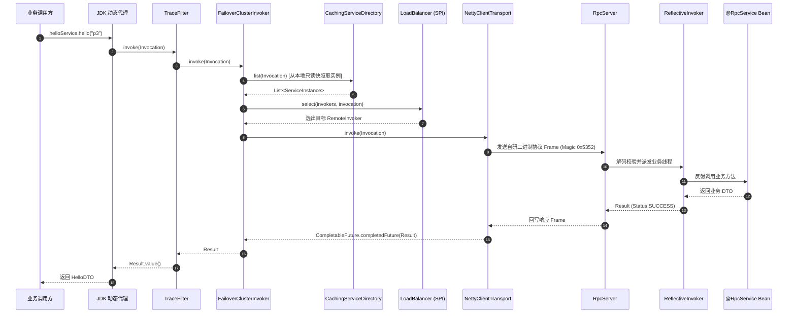

# Small-RPC 2.0

[](LICENSE)
[](https://central.sonatype.com/artifact/io.github.upowerman/small-rpc-spring-boot-starter)
[](https://www.oracle.com/java/)
[](https://netty.io/)
[](https://spring.io/projects/spring-boot)

## 📖 项目简介

**Small-RPC** 是一款专为深入理解分布式 RPC 内核原理而设计的高性能、轻量级、高度可扩展的 Java RPC 框架。

在 2.0 架构中，框架完成了全面的模块化重构与现代微服务治理升级：
- **微内核架构**：核心抽象与网络传输彻底解耦，核心层 `rpc-core` 达成对网络协议与序列化的零依赖；
- **自研工业级 SPI**：支持默认实现绑定、依赖注入（内置环检测）、运行时自适应动态分发；
- **事件驱动注册中心**：彻底退役 1.x 同步拉取模型，重构为 `Registry` 订阅-推送模型，配合 `CachingServiceDirectory` 本地快照缓存实现无锁极速读取与**注册中心故障无损降级**；
- **全套生态扩展**：开箱即用支持本地直连、Apache ZooKeeper（Curator 5.6 临时节点 + 真实推送）及 Redis（Jedis 4.4 Set 注册表 + 轮询差量比对推送）；
- **优雅停机与容错**：Failover 集群重试、全链路 Trace 上下文、Spring Boot 优雅下线与自动注销。

> ⚠️ **学习与研究定位**：本项目专注于核心机制的极致清晰呈现与工程规范设计，适合深入学习分布式网络编程、RPC 通信协议与服务治理机制。

---

## 🏗️ 模块架构

整个工程由父 POM 统一管理依赖与插件版本（基于 Spring Boot 2.7.18 依赖管理生态），划分为 8 个职责单一的子模块：

| 模块名 | 核心职责 | 核心依赖 |
|---|---|---|
| **`rpc-core`** | 微内核抽象：SPI 机制、Invocation、Invoker、Filter 链路、LoadBalancer、Registry 抽象、CachingServiceDirectory 缓存降级 | 仅 `slf4j-api`（零第三方协议与传输依赖） |
| **`rpc-transport-netty`** | 自研二进制协议帧（Magic `0x5352`）编解码、Netty 4 通信引擎、SerializerRegistry、Hessian 序列化、RpcServer | Netty 4.1, Hessian 4.0 |
| **`rpc-registry-local`** | 本地直连注册中心：支持静态配置与单进程内存服务注册，用于本地开发与单机测试 | `rpc-core` |
| **`rpc-registry-zookeeper`** | ZooKeeper 注册中心：EPHEMERAL 临时实例节点、PathChildrenCache 实时事件推送、自动断网重连 | Apache Curator 5.6, ZooKeeper 3.7+ |
| **`rpc-registry-redis`** | Redis 注册中心：Set 集合注册表、定时差量比对推送、线程安全调度管理 | Jedis 4.4 |
| **`small-rpc-spring`** | Spring 框架集成：`@RpcService` 服务导出、`@RpcReference` 引用注入、`ReferenceBeanPostProcessor` 代理创建 | Spring Context 5.3+ |
| **`small-rpc-spring-boot-starter`** | Spring Boot 自动装配：自动装配 Provider/Consumer、配置驱动、优雅停机注销生命周期 | Spring Boot Autoconfigure 2.7+ |
| **`rpc-examples`** | 端到端示例工程：`rpc-example-api`（接口定义）、`rpc-example-server`（提供方）、`rpc-example-client`（消费端与 Web 控制器） | Spring Boot Starter Web |

---

## 🔄 自研 SPI 扩展机制

框架采用统一的 SPI 扩展规范，扩展点定义文件统一存放于 `META-INF/small-rpc/<接口全限定名>`，格式为 `扩展名=实现类全限定名`。

### 核心特性

1. **`@Spi("defaultName")`**：
   标注在 SPI 接口上声明默认扩展名。例如 `@Spi("random") public interface LoadBalancer`。
2. **`@SpiInject` 字段依赖注入**：
   在扩展实现类的字段上标注该注解，SPI 加载器会自动解析并注入对应依赖类型的默认单例；内置同线程环依赖检测，发现依赖成环时立即抛出 `IllegalStateException` 大声失败。
3. **`@Adaptive("key")` 动态自适应代理**：
   根据方法入参 `Invocation` 的 `attachments[key]` 键值动态路由到具体的扩展实现，未传时平滑回退到默认扩展。
4. **多资源防重载 (name, FQCN)**：
   在多 ClassLoader 或 Classpath 覆盖环境下，精确匹配扩展名与类名，幂等去重；若扩展名相同但类名不同则严格报错。

### 核心 SPI 扩展点

| 接口 | SPI 文件名 | 内置实现名 | 默认值 |
|---|---|---|---|
| `Registry` | `io.github.upowerman.core.registry.Registry` | `local`, `zookeeper`, `redis` | `local` |
| `LoadBalancer` | `io.github.upowerman.core.loadbalance.LoadBalancer` | `random`, `roundrobin` | `random` |
| `Serializer` | `io.github.upowerman.core.serialize.Serializer` | `hessian`（typeId=1） | `hessian` |
| `Filter` | `io.github.upowerman.core.filter.Filter` | `trace` | — |

---

## 🌐 注册中心订阅与缓存降级

### 1. 订阅-推送事件驱动模型
- 彻底摒弃传统 1.x 每次 RPC 调用都向注册中心发起同步 Pull 的低效架构；
- `Registry` 接口采用 `subscribe(service, ServiceListener)`，注册中心状态发生变化时异步回调 `ServiceListener.onChange(snapshot)` 推送**全量不可变实例快照**；
- Provider 实例通过 Spring 容器生命周期管理，在启动绑定端口后自动向注册中心注册，在停机阶段（Spring 上下文销毁或 SIGTERM 信号触发 ShutdownHook）自动调用 `unregister`，实现干净摘除。

### 2. CachingServiceDirectory 缓存降级承诺
- **业务调用永不阻塞**：RPC 消费端发起请求时，仅从本地 `ConcurrentHashMap` 缓存读取实例列表，不与任何远程注册中心产生网络同步等待；
- **注册中心故障无损降级**：当注册中心发生网络分区、抖动、甚至全量停机时，本地缓存被**完全冻结保留**，已有服务实例的调用完全不受影响（降级继续可用）；
- **故障自愈**：当注册中心节点恢复并重连成功后，实时推送管道自动恢复，缓存即时刷新为最新状态。

---

## 🚀 三种服务消费方式

Small-RPC 2.0 提供了三种灵活的服务消费模型，覆盖从本地极速调试到生产集群治理的全部场景：

### 方式 1：Local 默认配置直连
适合本地单机联调，客户端直接配置目标 Provider 地址（支持 IDE 属性智能补全）：
```yaml
small-rpc:
  consumer:
    enabled: true
  provider:
    enabled: false
  registry:
    type: local
    local:
      direct-address: localhost:7081
```
> [!NOTE]
> 为保证向下兼容，历史配置格式 `small-rpc.registry.param.DIRECT_ADDRESS` 依然完全支持并作为备选兜底。

### 方式 2：`@RpcReference(address = "...")` 注解级点对点直连
在代码层面显式指定特定实例地址，完全跳过注册中心寻址与负载均衡：
```java
@RestController
public class OrderController {
    // 强制点对点调用指定 IP 与端口，适合调试与金丝雀灰度验证
    @RpcReference(address = "127.0.0.1:7081")
    private HelloService helloService;
}
```

### 方式 3：注册中心集群服务发现与动态负载均衡
面向微服务分布式部署，由注册中心进行实例管理，并结合 `LoadBalancer` 动态调度与容错：
```yaml
small-rpc:
  consumer:
    enabled: true
  provider:
    enabled: false
  registry:
    type: zookeeper      # 或 redis / local
    zookeeper:
      connect: localhost:2181
      namespace: small-rpc
  loadbalance: random    # random 或 roundrobin
```
若使用 Redis 注册中心：
```yaml
small-rpc:
  registry:
    type: redis
    redis:
      host: localhost
      port: 6379
```

---

## 🛠️ 快速开始

### 1. 添加 Maven 依赖

在 Spring Boot 应用的 `pom.xml` 中引入 starter（已默认内置单机 Local 直连注册中心，零外部依赖开箱即用）：

```xml
<dependency>
    <groupId>io.github.upowerman</groupId>
    <artifactId>small-rpc-spring-boot-starter</artifactId>
    <version>1.0.0</version>
</dependency>

<!-- 生产环境集群部署：按需引入分布式注册中心实现（二选一） -->
<!-- 1. ZooKeeper 注册中心 -->
<dependency>
    <groupId>io.github.upowerman</groupId>
    <artifactId>rpc-registry-zookeeper</artifactId>
    <version>1.0.0</version>
</dependency>

<!-- 2. Redis 注册中心 -->
<dependency>
    <groupId>io.github.upowerman</groupId>
    <artifactId>rpc-registry-redis</artifactId>
    <version>1.0.0</version>
</dependency>
```

### 2. 服务提供方（Provider）实现

在 `application.yml` 中配置服务提供端端口：
```yaml
server:
  port: 8090
small-rpc:
  provider:
    rpc2-port: 7081
  consumer:
    enabled: false    # 纯提供方建议关闭消费端装配（防无用代理注入）
  registry:
    type: local       # 本地直连；集群环境可换为 zookeeper 或 redis
```

定义业务接口与实现类，使用 `@RpcService` 暴露服务：
```java
@Service
@RpcService
public class HelloServiceImpl implements HelloService {
    @Override
    public HelloDTO hello(String name) {
        return new HelloDTO(name, "hello world");
    }
}
```

### 3. 服务消费方（Consumer）引用

在 Controller 或 Service 中通过 `@RpcReference` 注入远程代理对象：

```java
@RestController
public class HelloController {
    @RpcReference
    private HelloService helloService;

    @GetMapping("/rpc2/hello")
    public HelloDTO hello(@RequestParam("name") String name) {
        return helloService.hello(name);
    }
}
```

---

## 🧪 多实例集群与高可用验证指南

工程提供了完整的样例（`rpc-example-server` 与 `rpc-example-client`），支持多实例负载均衡、故障节点自动摘除与注册中心停机降级验证。

### 场景 A：ZooKeeper 多实例与节点故障自动剔除

1. **启动本地 ZooKeeper**（Docker）：
   ```bash
   docker run -d --name zookeeper -p 2181:2181 zookeeper:3.9
   ```

2. **启动提供方实例 1**（Web: 8090, RPC: 7081）：
   ```bash
   java -jar rpc-examples/rpc-example-server/target/rpc-example-server-1.0.0.jar \
     --spring.profiles.active=zookeeper --server.port=8090 --small-rpc.provider.rpc2-port=7081
   ```

3. **启动提供方实例 2**（Web: 8092, RPC: 7082）：
   ```bash
   java -jar rpc-examples/rpc-example-server/target/rpc-example-server-1.0.0.jar \
     --spring.profiles.active=zookeeper --server.port=8092 --small-rpc.provider.rpc2-port=7082
   ```

4. **启动消费方**（Web: 8091）：
   ```bash
   java -jar rpc-examples/rpc-example-client/target/rpc-example-client-1.0.0.jar \
     --spring.profiles.active=zookeeper --server.port=8091
   ```

5. **验证多实例负载均衡**：
   连续发起 20 次请求：
   ```bash
   for i in {1..20}; do curl -s "http://127.0.0.1:8091/rpc2/hello?name=zk-$i"; done
   ```
   查看服务端日志，调用均匀分摊在 7081 与 7082 两台实例上。

6. **验证宕机摘除与故障转移**：
   直接 kill 实例 1（`kill -9 <实例1的PID>`）。
   等待 ZooKeeper 会话超时（≤10s），再次连续调用 20 次：
   所有调用保持 100% 成功，且**全部平滑转移至存活的 7082 实例**！

---

### 场景 B：注册中心停机无损降级验证（Spec §3 核心承诺）

1. 在上述 ZooKeeper 集群运行中，消费端已经建立订阅；
2. **完全停止 ZooKeeper 服务**：
   ```bash
   docker stop zookeeper
   ```
3. 发起调用验证降级：
   ```bash
   curl -s "http://127.0.0.1:8091/rpc2/hello?name=degraded"
   ```
   **调用依然正常返回 200**！此时消费端依靠本地内存冻结快照继续服务，丝毫不受注册中心宕机影响。
4. **恢复 ZooKeeper 服务**：
   ```bash
   docker start zookeeper
   ```
   消费端与服务端自动完成重连，实时推送与目录同步自动恢复。

---

### 场景 C：Redis 注册中心多实例演示

1. **启动本地 Redis**（Docker）：
   ```bash
   docker run -d --name redis -p 6379:6379 redis:7
   ```
2. 启动两台 Provider 与一台 Consumer，附带参数 `--spring.profiles.active=redis`；
3. 发起调用观察负载均衡；
4. 优雅关闭实例 1（`kill <实例1PID>`），Provider 自动触发注销，Redis 轮询任务比对后在 3~5 秒内自动更新客户端缓存，后续调用平滑切换至 7082 存活实例。

---

## ⚙️ 全量配置项参考

| 配置项 | 默认值 | 类型 | 详细说明 |
|---|---|---|---|
| `small-rpc.provider.enabled` | `true` | Boolean | 是否启用服务提供端（纯消费端应用请务必设为 `false`，防端口占用） |
| `small-rpc.provider.rpc2-port` | `7081` | Integer | RpcServer Netty 监听端口 |
| `small-rpc.provider.address` | 自动探测本机 IP | String | 提供端对外注册的地址（`IP:Port`），多网卡或容器端口映射环境下建议显式配置 |
| `small-rpc.consumer.enabled` | `true` | Boolean | 是否启用服务消费端 |
| `small-rpc.registry.type` | `local` | String | 注册中心 SPI 扩展名：`local` / `zookeeper` / `redis` |
| `small-rpc.registry.local.direct-address` | `""` | String | Local 直连模式下的目标 Provider 地址（支持 IDE 属性智能补全） |
| `small-rpc.registry.zookeeper.connect` | `localhost:2181` | String | ZooKeeper 连接串（支持多地址逗号分隔） |
| `small-rpc.registry.zookeeper.namespace` | `small-rpc` | String | ZooKeeper 命名空间根路径 |
| `small-rpc.registry.zookeeper.session-timeout-ms` | `10000` | Integer | ZooKeeper 会话超时时间（毫秒） |
| `small-rpc.registry.zookeeper.connection-timeout-ms` | `3000` | Integer | ZooKeeper 连接建立超时时间（毫秒） |
| `small-rpc.registry.redis.host` | `localhost` | String | Redis 服务器主机名/IP 地址 |
| `small-rpc.registry.redis.port` | `6379` | Integer | Redis 服务器端口（1~65535） |
| `small-rpc.registry.redis.database` | `0` | Integer | Redis 数据库索引（默认为 0） |
| `small-rpc.registry.redis.timeout-ms` | `2000` | Integer | Redis 连接与读取超时时间（毫秒） |
| `small-rpc.registry.redis.password` | 无 | String | Redis 认证密码（无密码留空） |
| `small-rpc.registry.redis.key-prefix` | `small-rpc:registry:` | String | Redis 注册表集合 Key 前缀 |
| `small-rpc.registry.redis.poll-interval-ms` | `3000` | Long | Redis 注册表差量比对拉取周期（毫秒） |
| `small-rpc.registry.param.*` | - | Map<String, String> | 底层注册中心原始通用参数字典（向下兼容，同名键优先级高于强类型默认值） |
| `small-rpc.loadbalance` | `random` | String | 全局负载均衡算法 SPI 名：`random`（随机）或 `roundrobin`（轮询） |

---

## 🔄 架构与调用全链路时序图

### 2.0 端到端调用时序


```mermaid
sequenceDiagram
    autonumber
    participant App as 业务调用方
    participant Proxy as JDK 动态代理
    participant Filter as TraceFilter
    participant Cluster as FailoverClusterInvoker
    participant Dir as CachingServiceDirectory
    participant LB as LoadBalancer (SPI)
    participant Client as NettyClientTransport
    participant Server as RpcServer
    participant Invoker as ReflectiveInvoker
    participant Svc as @RpcService Bean

    App->>Proxy: helloService.hello("p3")
    Proxy->>Filter: invoke(Invocation)
    Filter->>Cluster: invoke(Invocation)
    Cluster->>Dir: list(Invocation) [从本地只读快照取实例]
    Dir-->>Cluster: List<ServiceInstance>
    Cluster->>LB: select(invokers, invocation)
    LB-->>Cluster: 选出目标 RemoteInvoker
    Cluster->>Client: invoke(Invocation)
    Client->>Server: 发送自研二进制协议 Frame (Magic 0x5352)
    Server->>Invoker: 解码校验并派发业务线程
    Invoker->>Svc: 反射调用业务方法
    Svc-->>Invoker: 返回业务 DTO
    Invoker-->>Server: Result (Status.SUCCESS)
    Server-->>Client: 回写响应 Frame
    Client-->>Cluster: CompletableFuture.completedFuture(Result)
    Cluster-->>Filter: Result
    Filter-->>Proxy: Result.value()
    Proxy-->>App: 返回 HelloDTO
```

---

## 📜 许可证

本项目基于 [Apache License 2.0](LICENSE) 开源协议。